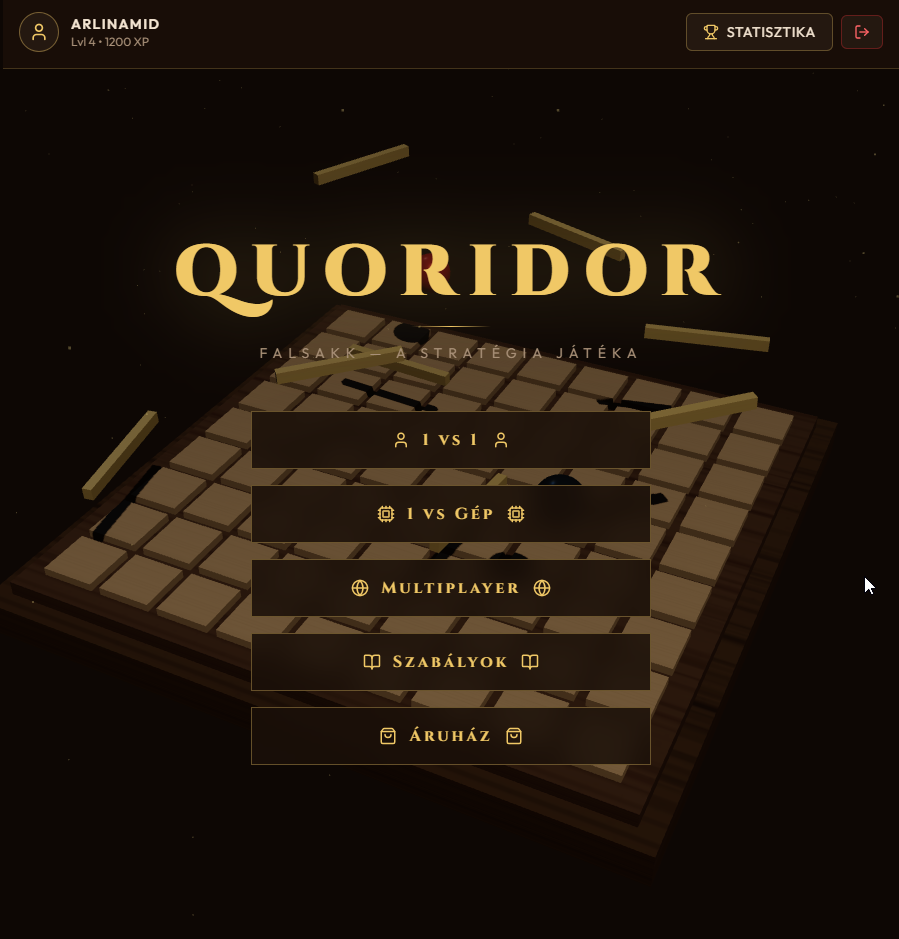
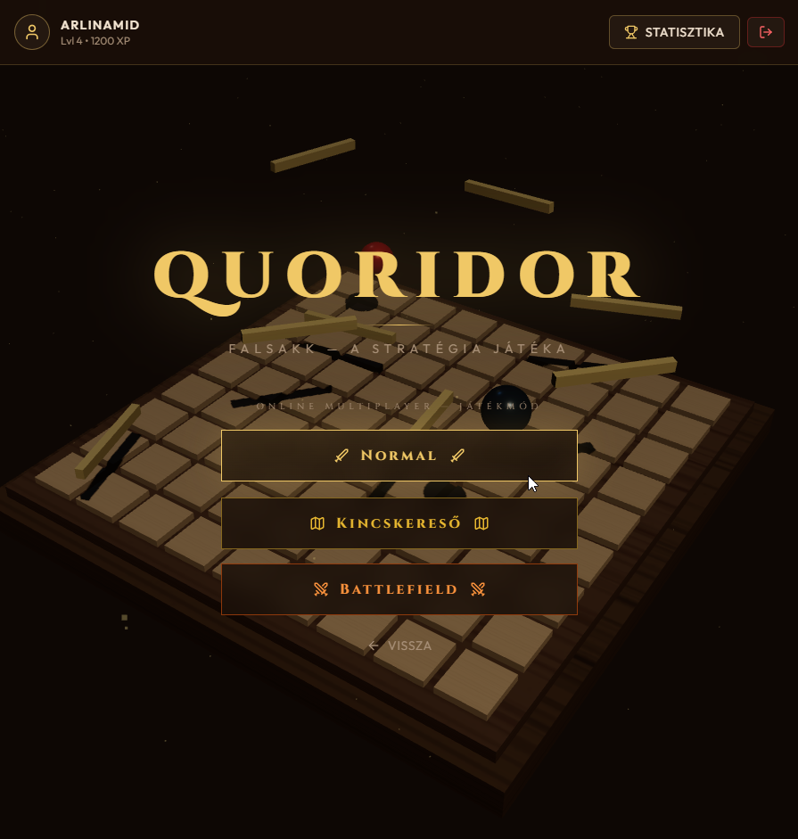
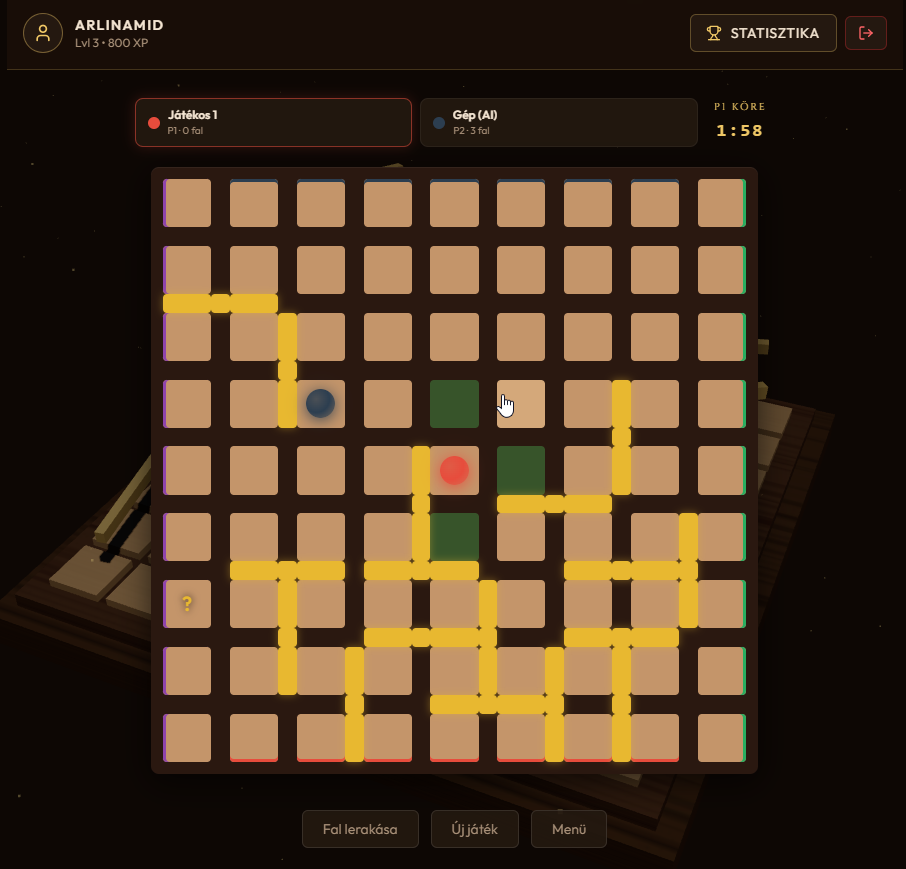
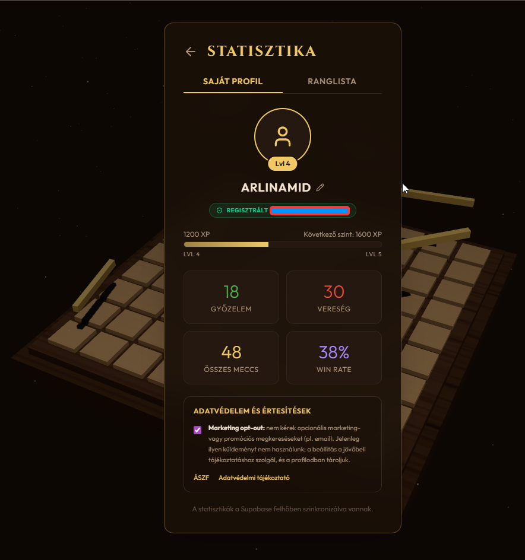
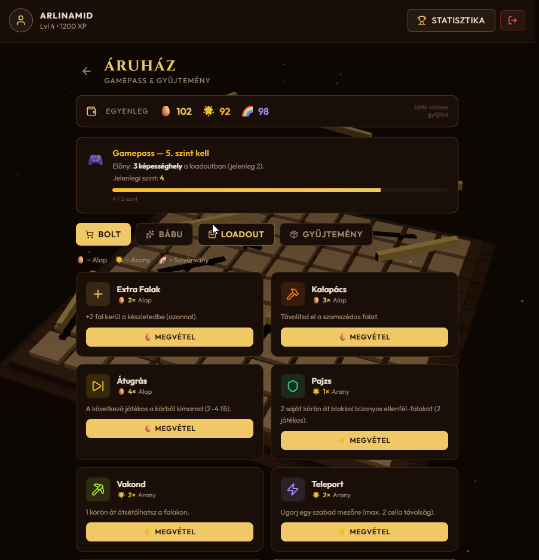
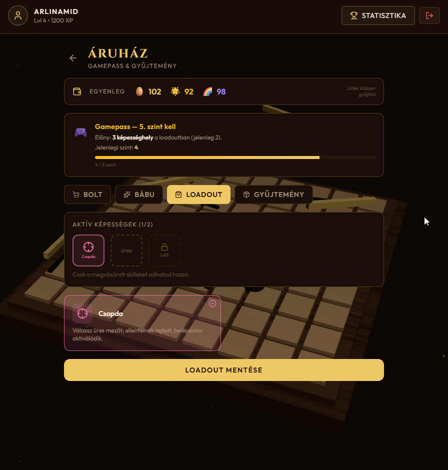

# Quoridor Falsakk

| Élő játék | Forráskód | Verzió |
| :---: | :---: | :---: |
| [](https://quoridor-snowy.vercel.app) | [](https://github.com/arlinamid/quoridor) |  |

| [React](https://react.dev/) | [TypeScript](https://www.typescriptlang.org/) | [Vite](https://vitejs.dev/) | [Tailwind](https://tailwindcss.com/) | [Supabase](https://supabase.com/) | [Vercel](https://vercel.com/) | [Three.js](https://threejs.org/) | Felület |
| :---: | :---: | :---: | :---: | :---: | :---: | :---: | :---: |
| [](https://react.dev/) | [](https://www.typescriptlang.org/) | [](https://vitejs.dev/) | [](https://tailwindcss.com/) | [](https://supabase.com/) | [](https://vercel.com/) | [](https://threejs.org/) |  |

**Stratégiai táblajáték a böngészőben** — a klasszikus Quoridor „falazós” versenyét egészítjük ki kincsekkel, képességekkel és egy külön **Battlefield** pályatípussal. A felület **magyar nyelvű**; játszhatsz **egymás mellett**, a **gép ellen** vagy **online**, akár **négyen**, csapatban vagy mindenki magának.

### [Játszd most → quoridor-snowy.vercel.app](https://quoridor-snowy.vercel.app)



*Főmenü — fa tábla, 3D háttér, magyar UI; profil, szint és XP a fejlécben.*

---

## Képernyőképek

### Online — játékmód választás



*Online multiplayer: **Normal**, **Kincskereső**, **Battlefield** — külön lobby és szabályok módonként.*

### Játék közben (1 vs gép)



*Tábla: lépés vagy fal, célzónák, körönkénti időkorlát; kincskereső módban kérdőjel a rejtett kincsen.*

### Statisztika és profil



*Profil: XP, szint, meccsek, win rate; ranglista fül; adatvédelem és ÁSZF linkek.*

### Áruház és loadout



*Áruház: tojás alapú economy, Gamepass (3. skill slot 5. szinttől), vásárolható képességek.*



*Loadout: induláskor használt képességek (szint szerinti slotok).*

---

## A játék lényege

Minden körben döntesz: **lépsz egyet** (átugrva is lehet az ellenfélt, ha szabályos), **vagy falat helyezel el**. A cél: **elsőként elérni a szemközti oldalt** (vagy a pályán kijelölt célvonalat). A falak szűkítik a teret — egyszerre taktika, blöff és versenyfutás.

A **Kincskereső** és **Battlefield** módok ezt tovább bontják: a pályán kincsek lapulnak, **ásással** új képességeket szerezhetsz, és olyan skilljeid lehetnek, mint a teleport, a kalapács, a pajzs vagy a csapda. **Battlefield** alatt a táblán **árokmezők** is vannak (nem járhatsz át rajtuk), **kevesebb fal** jár játékosonként, és a csapdák egy része **csak a lerakónak látszik** — feszesebb, „terep” érzetű meccsek.

---

## Mit kapsz egy helyen?

| Élmény | Röviden |
|--------|---------|
| **9 játékmód** | Klasszikus / Kincskereső / Battlefield × helyi 1v1, gép ellen, online |
| **2–4 játékos online** | Lobby, meghívószerű várakozó lista, host indítja a meccset |
| **Csapatjáték** | 3–4 főnél FFA vagy fix felállás (pl. 1 kontra 2, 2 kontra 2) |
| **Botok** | Üres helyeket feltölthetsz gépi játékossal — így mindig összejön a létszám |
| **AI nehézségek** | Könnyű, közepes, nehéz — egyjátékos módban gyakorolhatsz |
| **Szint & ranglista** | XP győzelemért és részvételért; profil, statisztika |
| **Áruház & kinézetek** | Tojásokból vásárolható képességek, bábu skinek, Gamepass előnyök |
| **Hangulat** | Fa tábla, animációk, 3D-s háttér — nem egy száraz „demó”, hanem játékérzet |

---

## Játékmódok

| Mód | Neked való, ha… | XP (összefoglalva) |
|-----|-----------------|---------------------|
| **1 vs 1 — Normal** | Tiszta, gyors Quoridor ketten, egy képernyőn | +20 helyi |
| **1 vs 1 — Kincskereső** | Ugyanez + kincsek, ásás, skillek | +20 helyi |
| **1 vs 1 — Battlefield** | Kincs + skillek + árkok + kevesebb fal | +20 helyi |
| **1 vs Gép** *(3 nehézség)* | Magadban tanulnál vagy kikapcsolódnál | +50 győzelem / +10 vereség |
| **Online — Normal / Kincs / Battlefield** | Barátokkal vagy ismeretlenekkel, valós időben | +50 / +10 |

Az online **Battlefield** meccsek **külön lobbyban** jelennek meg, hogy azonos szabályú társakat találj.

---

## Online: miért működik jól?

- **Várakozó szoba** — létrehozol vagy csatlakozol egy meccshez; a host elindítja, ha legalább ketten vagytok (vagy botokkal kiegészítve).
- **Visszalépés** — ha megszakad a kapcsolat, rövid időn belül visszatérhetsz a folyamatban lévő partiba.
- **Csapat üzenetek** — ha csapatban játszotok, a győzelem képernyő **csapattársakra** is szabott (nem csak „te nyertél / vesztettél”).
- **Igazságos lezárás** — inaktív meccsek lezárása, hogy ne maradjon „örökre nyitott” játék a listában.

---

## Szabályok röviden

- **Tábla:** 9×9 mező; **2–4 játékos**, mindegyiknek saját **indulási oldal** és **célja** van (sor vagy oszlop szerint).
- **Falak:** klasszikus módban 10 / 7 / 5 fal játékosszámtól függően; **Battlefield** alatt kevesebb, cserébe **árok** van a pályán.
- **Szabályos fal:** minden bábunak marad útja a cél felé.
- **Kincskereső / Battlefield:** a pályán kincsek; **ásással** új skill kerül a készletedbe (szabályok szerinti limit és pool).
- A részletes szabályok és skill leírások **a játék „Szabályok” oldalán** is elérhetők.

### Képességek (Kincskereső) — áttekintés

| Képesség | Mire jó? |
|----------|----------|
| **TELEPORT** | Rövid ugrás üres mezőre (árokra nem) |
| **HAMMER** | Egy fal ledöntése |
| **SKIP** | Ellenfél egy körének kihagyása |
| **MOLE** | Következő körben falakon át is léphetsz |
| **DYNAMITE** | Egy kereszteződés körüli falak robbanása |
| **SHIELD** | Rövid ideig védelem falak ellen |
| **WALLS** | Extra falak azonnal |
| **MAGNET** | Ellenfelek mezőhúzása (szabályok szerint) |
| **TRAP** | Rejtett csapda — Battlefield alatt csak a lerakó látja jól |
| **SWAP** | Pozíciócsere egy ellenféllel |

---

## Tojások, áruház, Gamepass

Játék közben **ritka tojások** bukkanhatnak fel (különösen eseményidőszakban). Ezekből az **Áruházban** vásárolhatsz skilleket és **bábu kinézeteket**. A **Gamepass** (magasabb szinten) több képességhelyet ad a loadoutban.

| Tojás | Szerepe |
|-------|---------|
| Alap | Közönségesebb skillek |
| Arany | Ritka képességek |
| Szivárvány | Látványos, erősebb opciók |

*(A pontos drop és ár a játékban látható.)*

---

## Fiók, adatvédelem, jog

- Bejelentkezés **vendégként** vagy **e-mail (magic link)** jelszó nélkül.
- **ÁSZF** és **adatvédelmi tájékoztató** a bejelentkezési képernyőn és a profil/ranglista nézetben.
- **Marketing értesítések** kikapcsolhatók a profilban.

---

## Fejlesztőknek

Nyílt forráskódú frontend; a teljes **adatbázis-séma**, **RPC-k** és **migrációk** a repóban: `supabase-schema.sql`, `supabase/migrations/`. Változások: **`CHANGELOG.md`**.

### Technológia (röviden)

React 19, TypeScript, Vite, Tailwind, Motion, Three.js háttér; **Supabase** (auth, Postgres, realtime); deploy **Vercel**; API route-ok heartbeat és játék-életciklushoz.

### Lokális futtatás

```bash
npm install
cp .env.example .env.local   # töltsd ki a Supabase kulcsokkal, ha kell online
npm run dev
```

```env
VITE_SUPABASE_URL=https://<project>.supabase.co
VITE_SUPABASE_ANON_KEY=<anon-key>
```

Supabase nélkül a játék **lokális profillal** is elindul (nincs online).

### Build

```bash
npm run build
```

### Vercel + Supabase (éles)

- A `api/` route-okhoz a Vercelen **`SUPABASE_URL`** és **`SUPABASE_SERVICE_ROLE_KEY`** kell (csak szerveroldalon).
- Migrációk feltöltése: `npx supabase db push --linked --yes` (részletek: `CHANGELOG.md`, `supabase/migrations/`).

### További SQL, cron, Edge Function

A korábbi, részletes **CREATE TABLE**, **pg_cron**, **award-xp** deploy és store RPC példák a repó **`supabase/migrations/`** fájljaiban és a **`supabase-schema.sql`** dokumentumban találhatók — ott érdemes karbantartani, hogy ne duplikáljuk őket a README-ben.

### README: Markdown és (opcionális) HTML

- **Badge-ek:** `[](link)` — vagy táblázatcellában, ahogy a fájl tetején.
- **Képek:** `` — tiszta Markdown, a GitHub a tároló szélességéhez igazítja.
- **Ha kell középre igazítás vagy fix szélesség** (pl. `width="780"`), egy sorban használhatsz HTML-t is (a GitHub README GFM ezt engedi):

```html
<p align="center"></p>
```

---

*Quoridor Falsakk — egy stratégiai táblajáték, amit érdemes **kipróbálni**, nem csak **klónozni**.*
